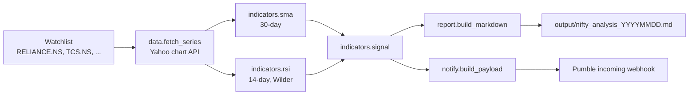

# ChatFin — Architecture

ChatFin is a linear five-stage pipeline wrapped around a set of pure functions.
The only side-effecting parts are the network calls (market data in, chat
webhook out), and those are pushed to the edges so the core stays testable.

## Data flow



## Component responsibilities

| Module | Responsibility | Side effects | Tested |
|---|---|---|---|
| `data.py` | Fetch & normalise daily closes | HTTP GET | via synthetic `Series` |
| `indicators.py` | `sma`, `rsi`, `signal`, `signal_reason` | none (pure) | ✅ unit |
| `report.py` | Markdown report string | file write (separate fn) | ✅ unit |
| `notify.py` | Build + POST webhook payload | HTTP POST | ✅ fake session |
| `pipeline.py` | Orchestrate the stages | composes the above | ✅ synthetic |

## Key interfaces

```python
# indicators.py — pure, deterministic
sma(values, period) -> float | None
rsi(values, period=14) -> float | None
signal(price, sma30, rsi14) -> "Bullish" | "Bearish" | "Neutral"

# data.py
@dataclass
class Series: symbol, closes, last_date, high_52, low_52
fetch_series(symbol, rng="6mo") -> Series

# notify.py
build_payload(signals, prefix="NIFTY 50 Signals") -> {"text": "..."}
send_webhook(url, payload) -> (status_code, body)
```

## Why the split matters

Isolating `indicators.py` and `report.py` as pure functions means the entire
signal logic and report layout can be verified without a network connection or
a live market — 33 tests run in about a second. The network-touching layers are
thin adapters (`requests.get` / `requests.post`) that the tests stub with fake
sessions and synthetic series.

## Signal rule (decision table)

| Condition | RSI | Signal |
|---|---|---|
| Close > SMA30 | ≥ 50 | **Bullish** |
| Close > SMA30 | < 50 | Neutral |
| Close < SMA30 | < 50 | **Bearish** |
| Close < SMA30 | ≥ 50 | Neutral |
| missing data | — | Neutral |

## Delivery contract

The chat layer sends a single JSON object, `{"text": "<summary>"}`, to a Pumble
incoming webhook — the lowest-friction way to put a signal in front of a human
without building a UI:

```
NIFTY 50 Signals | RELIANCE: Bearish | TCS: Bearish | HDFCBANK: Bullish | INFY: Bearish | ICICIBANK: Bearish
```
