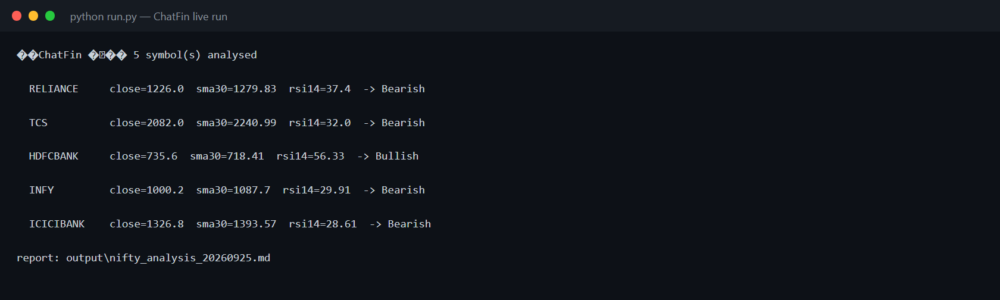
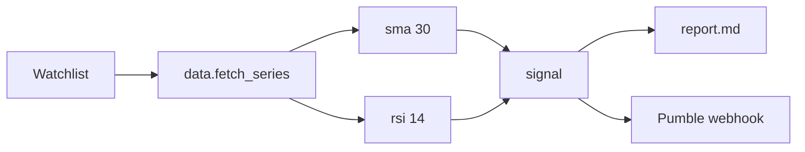
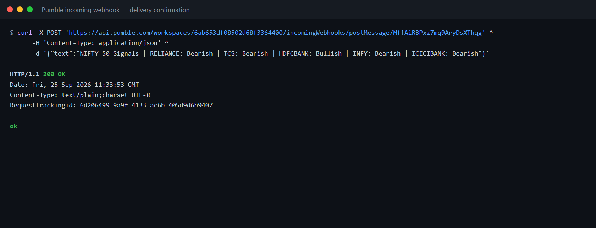
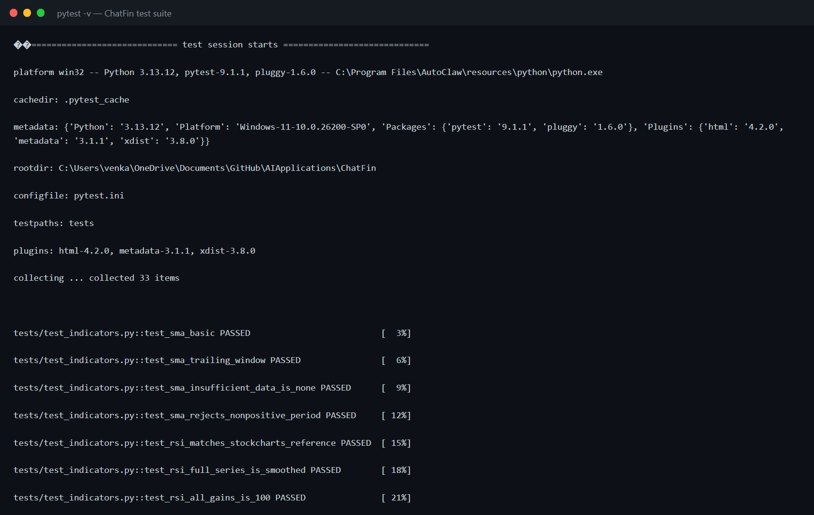
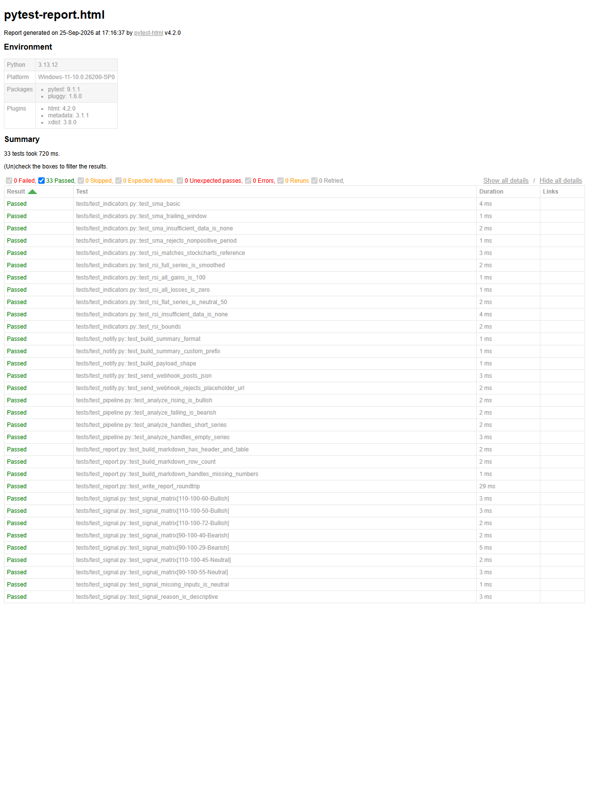

# I Built a Stock-Signal Agent That Reports Straight Into Team Chat — Here's the Whole POC

*Turning five NIFTY 50 tickers into a Bullish/Bearish summary that lands in your
chat in one command — with a 33-test suite and zero paid APIs.*

---

Every retail investor I know runs the same loop: open a charting site, eyeball a
few moving averages, squint at the RSI, and try to remember what they concluded
yesterday. It works — until you're tracking more than two or three names, or
until you want the same read to land where your team actually talks.

So I built **ChatFin**: a small agent that takes a watchlist of NSE stocks,
computes a 30-day SMA and a 14-day RSI for each, turns that into a
Bullish / Bearish / Neutral call, writes a Markdown report, and posts a one-line
summary into a chat channel via a Pumble incoming webhook.

```bash
python run.py --webhook "https://api.pumble.com/.../postMessage/xxxx"
```

```
ChatFin — 5 symbol(s) analysed
  RELIANCE     close=1226.0  sma30=1279.83  rsi14=37.4  -> Bearish
  TCS          close=2082.0  sma30=2240.99  rsi14=32.0  -> Bearish
  HDFCBANK     close=735.6   sma30=718.41   rsi14=56.33 -> Bullish
  INFY         close=1000.2  sma30=1087.7   rsi14=29.91 -> Bearish
  ICICIBANK    close=1326.8  sma30=1393.57  rsi14=28.61 -> Bearish
report: output\nifty_analysis_20260925.md
```



That's the whole pitch. The interesting part is what it took to make it
trustworthy in about a hundred lines of real logic.

## The design bet: keep the math pure

The temptation with a script like this is to write one file that fetches,
computes, prints, and posts. It runs — and then you can never confidently
change the RSI again, because nothing is testable without hitting a live market.

ChatFin splits the pipeline so that **everything except the two network calls is
a pure function**:



- `indicators.py` — `sma`, `rsi`, `signal`: no I/O, fully deterministic.
- `report.py` — builds the Markdown string; writing is a separate call.
- `notify.py` — builds the payload, then POSTs it.
- `data.py` — the only market-facing code, isolated behind one function.

Five modules, one job each. The consequence: the entire signal engine and report
layout can be verified **without a network connection**, which is what makes the
test suite fast and honest.

## Getting the indicators right (the part people get wrong)

A 30-day SMA is trivial. The 14-day RSI is where quiet bugs live, because there
are two conventions in the wild: a *simple* average of the last 14 gains/losses,
and **Wilder's smoothing**, where the average is updated recursively:

```
avg = (prev_avg * (n - 1) + current) / n
```

Almost every charting platform uses Wilder's. If you use the naive average,
your RSI will disagree with TradingView by a few points and you'll never know
why. ChatFin uses Wilder's, seeded with the simple average of the first 14
diffs.

To prove it, the test suite pins the **canonical StockCharts worked example** —
the one every RSI tutorial uses — and asserts the first value lands at
**70.53**:

```python
def test_rsi_matches_stockcharts_reference():
    val = rsi(STOCKCHARTS_CLOSES[:15], 14)
    assert math.isclose(val, 70.53, abs_tol=0.02)
```

If someone "simplifies" the RSI later and breaks the convention, that test
fails immediately. That's the point.

## The signal rule, stated plainly

I deliberately kept the decision rule boring and auditable:

| Condition | RSI (14) | Signal |
|---|---|---|
| Close **above** SMA30 | ≥ 50 | **Bullish** |
| Close **below** SMA30 | < 50 | **Bearish** |
| otherwise (mixed) | — | Neutral |

One line of code, seven test cases covering every branch including the exact
boundary (`RSI == 50`, `price == SMA30`). No black boxes, no "the model said
so."

## A run on real NIFTY 50 names

Pulled live on **2026-09-25** — five of the heaviest NIFTY constituents:

| Stock | Close (₹) | 30-day SMA (₹) | RSI (14) | Signal |
|---|---:|---:|---:|:--:|
| RELIANCE | 1226.00 | 1279.83 | 37.40 | **Bearish** |
| TCS | 2082.00 | 2240.99 | 32.00 | **Bearish** |
| HDFCBANK | 735.60 | 718.41 | 56.33 | **Bullish** |
| INFY | 1000.20 | 1087.70 | 29.91 | **Bearish** |
| ICICIBANK | 1326.80 | 1393.57 | 28.61 | **Bearish** |

Four of five screened Bearish — and here's the nuance the rule captures well:
**INFY and ICICIBANK are technically oversold (RSI < 30) but still flagged
Bearish**, because they remain below their 30-day averages. That's an important
distinction. "Oversold" is a state, not a trigger. The agent tells you where the
trend is; it doesn't pretend to call the bottom.

Only **HDFCBANK** was above its SMA30 with an RSI in the constructive 50–70
zone — the lone relative-strength name in the group.

## Delivering to chat, not to a dashboard

The whole reason to build this is to close the loop. A dashboard you have to
remember to open is a dashboard you stop opening. So the last stage is a
**Pumble incoming webhook** — one POST, one JSON object:

```bash
curl -X POST 'https://api.pumble.com/workspaces/.../incomingWebhooks/postMessage/...' \
  -H 'Content-Type: application/json' \
  -d '{"text":"NIFTY 50 Signals | RELIANCE: Bearish | TCS: Bearish | HDFCBANK: Bullish | INFY: Bearish | ICICIBANK: Bearish"}'
```

The webhook returns `200 OK` — here's the captured delivery:



The summary is designed to fit a phone notification: one line, ticker by ticker,
no scrolling. The full Markdown report is there for whoever wants the detail.

## The tests (and the screenshots to prove it)

The suite has **33 offline tests**: indicator math (including the RSI reference
value and edge cases — all-gains → 100, all-losses → 0), the signal matrix,
report formatting, webhook payload construction with a stubbed HTTP session, and
end-to-end analysis over synthetic rising and falling series.

```bash
python -m pytest
# ============================= 33 passed in 1.15s ==============================
```



I also generate a self-contained HTML report for the record:



Two bugs surfaced *during* verification and were fixed before shipping — exactly
what the tests are for:

1. **The RSI reference test failed on the first run** — I'd fed the whole
   series in, so I was reading the *final smoothed* value (37.77), not the
   documented *first* value (70.53). The fix was to test the seed window,
   which is the number the reference actually documents. The bug was in the
   test, not the indicator — but I only knew that because the assertion was
   specific.
2. **The report test crashed on `None`** — my test helper tried to compute
   `price - 1` for a missing price. A trivial fix, but it exercised the exact
   path that matters when a symbol returns no data.

## What I'd add next

- **A scheduler** — run at market close and post automatically (a cron job,
  not a human at a terminal).
- **More indicators** — MACD and volume confirmation, layered on the same
  pure-function pattern.
- **Backtesting** — the signals are already pure functions, so replaying
  history to measure hit-rate is a natural extension.
- **Portfolio state** — flag only the names you actually hold.

## The takeaway

The hard part of a "financial agent" isn't the finance — an SMA is two lines.
It's making the numbers **trustworthy and reproducible**: pinning the
convention (Wilder's, verified against a published reference), keeping the logic
pure so it's testable, and making the decision rule simple enough to read in one
glance. The chat delivery is the easy, delightful part that closes the loop.

The full POC — code, tests, screenshots, and architecture — lives in the
`ChatFin` folder of the repo.

> *Not investment advice. Automated technical screening on public data only.*

---

*Built as a self-contained POC: `python run.py`, `pip install requests`, done.*
