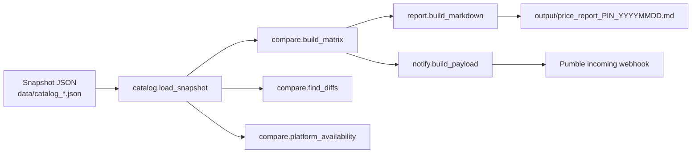

# ChatGrocery — Architecture

ChatGrocery is a linear pipeline wrapped around a set of pure functions. The
only side-effecting parts are the file read (snapshot in) and the network POST
(chat out), and both are pushed to the edges so the core stays testable.

## Data flow



## Component responsibilities

| Module | Responsibility | Side effects | Tested |
|---|---|---|---|
| `models.py` | `Quote`, `Snapshot` data classes | none | via all |
| `catalog.py` | Read & normalise the snapshot | file read | unit |
| `compare.py` | cheapest, spread, diffs, availability | none (pure) | 14 unit |
| `report.py` | Markdown report string | file write (separate fn) | 6 unit |
| `notify.py` | Build + POST webhook payload | HTTP POST | fake session |
| `pipeline.py` | Orchestrate the stages | composes the above | end-to-end |

## Key interfaces

```python
# compare.py — pure, deterministic
group_by_sku(quotes) -> {sku_id: [Quote]}
cheapest(quotes) -> Quote | None
cheapest_label(quotes) -> ("Blinkit/Swiggy Instamart", 77.0) | ("n/a", None)
sku_spread(quotes) -> float | None
find_diffs(quotes, threshold=10.0) -> [{sku, spread, cheapest, priciest, ...}]
platform_availability(quotes, platforms) -> {platform: bool}
build_matrix(quotes) -> [{sku_name, prices, cheapest, best_price, spread}]

# notify.py
build_payload(rows, prefix="Quick Commerce Prices") -> {"text": "..."}
send_webhook(url, payload) -> (status_code, body)      # rejects "YOUR_" placeholders
```

## Snapshot schema

```json
{
  "location": "Tiruchirappalli, Tamil Nadu",
  "pincode": "620001",
  "captured": "2026-09-25T17:17:00+05:30",
  "platforms": ["Blinkit", "Zepto", "Swiggy Instamart"],
  "skus": [
    {"id": "tata_salt_1kg", "name": "Tata Salt 1kg", "unit": "1 kg",
     "quotes": [
       {"platform": "Blinkit", "price": 22, "available": true},
       {"platform": "Zepto", "price": null, "available": false,
        "note": "Not serviceable at pincode 620001"},
       {"platform": "Swiggy Instamart", "price": 31, "available": true}
     ]}
  ]
}
```

## Why the split matters

Isolating `compare.py` and `report.py` as pure functions means the entire
comparison logic and report layout can be verified without a network connection
or a live dark store — 41 tests run in under half a second. The collector (a
browser session) and the delivery (a webhook POST) are the two thin, replaceable
edges.

## Diff rule (decision table)

| Condition | Result |
|---|---|
| spread **>** threshold (default ₹10) | SKU appears in the diff report |
| spread **==** threshold | not flagged (strict inequality) |
| fewer than two priced platforms | no spread, not flagged |
| all platforms unavailable | cheapest = `n/a` |

## Delivery contract

A single JSON object, `{"text": "<summary>"}`, POSTed to a Pumble incoming
webhook — the lowest-friction way to put a price in front of a human:

```
Quick Commerce Prices | Amul Taaza Milk 1L: Blinkit/Swiggy Instamart Rs.77 | Tata Salt 1kg: Blinkit Rs.22 | Aashirvaad Atta 5kg: Blinkit/Swiggy Instamart Rs.327
```
