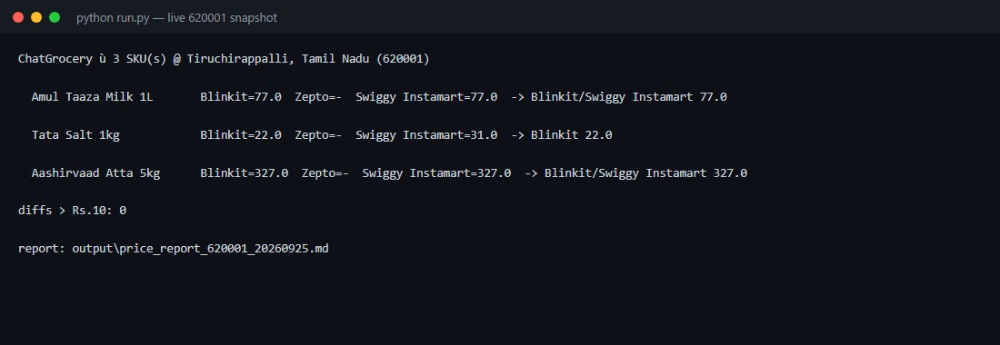
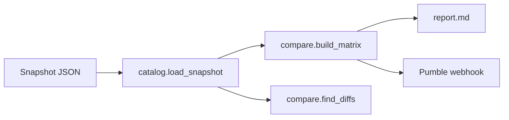
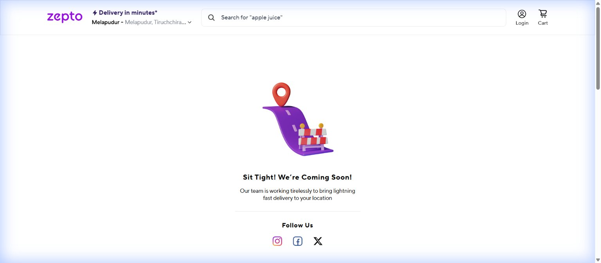
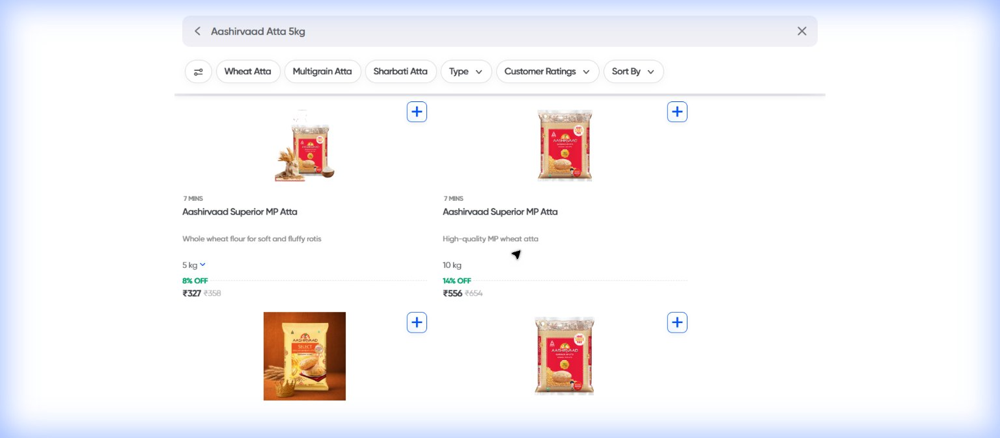
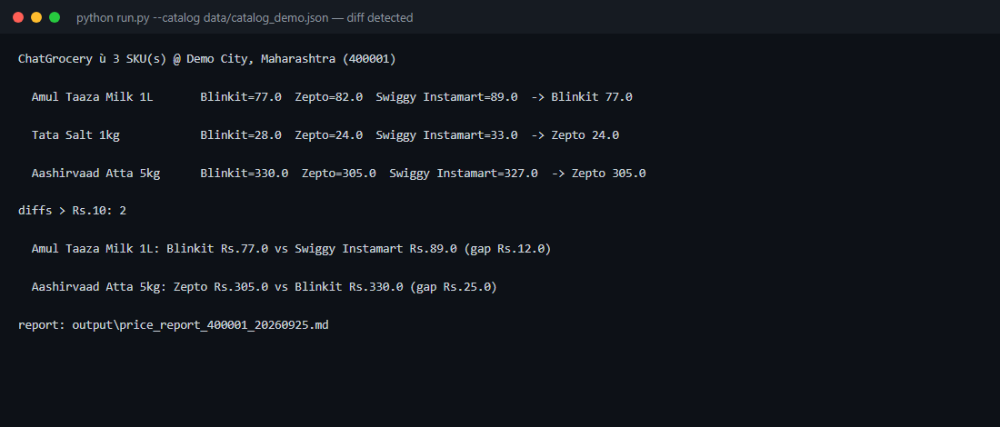
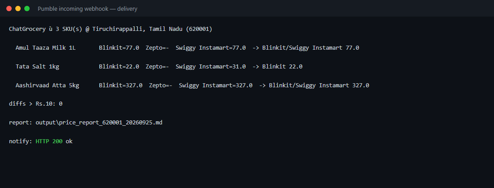
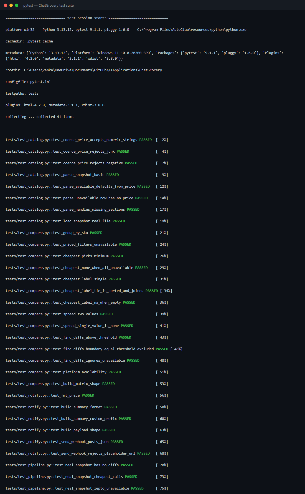
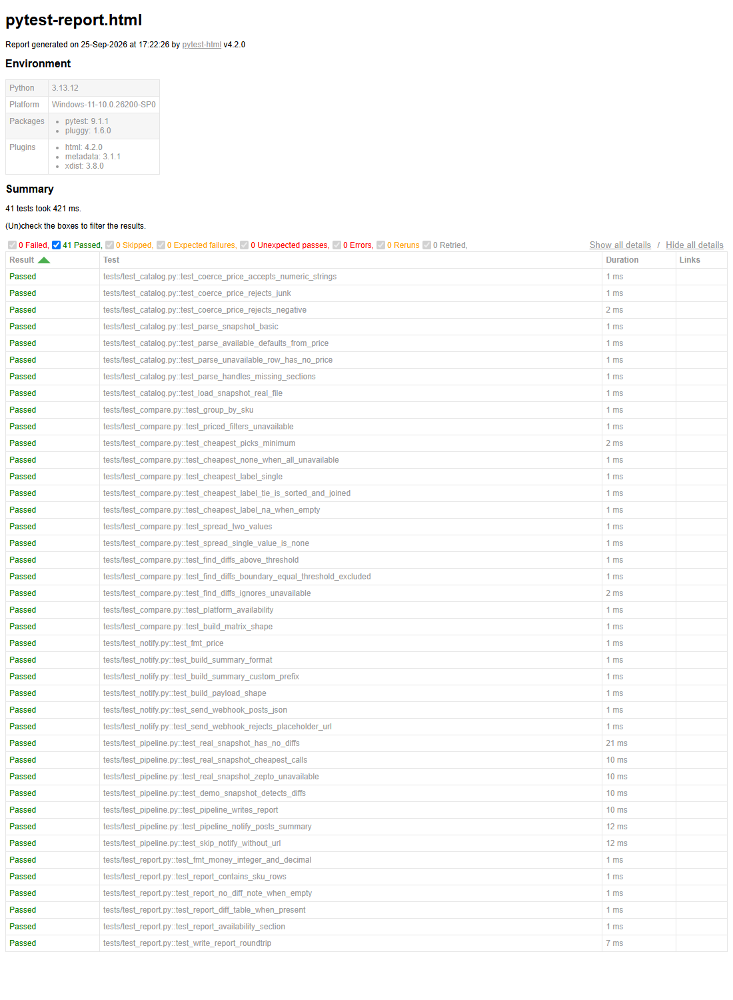

# I Built a Price-Monitoring Agent for Indian Quick Commerce — Here's the Whole POC

*Tracking three everyday SKUs across Blinkit, Zepto and Swiggy Instamart for one
pincode, finding the cheapest of each, and dropping the answer into team chat —
with a 41-test suite and zero paid APIs.*

---

If you buy groceries on quick commerce in India, you already know the routine:
the same packet of salt can cost ₹22 on one app and ₹31 on another, and the
"cheapest" answer changes by the hour. Comparing three apps by hand, on your
phone, for a handful of staples is exactly the kind of dull, repetitive task an
agent should own.

So I built **ChatGrocery**: a small agent that takes a price snapshot for a set
of SKUs across **Blinkit**, **Zepto** and **Swiggy Instamart** for one delivery
pincode, finds the cheapest platform for each product, flags any cross-platform
gap above a threshold, writes a Markdown report, and posts a one-line summary
into a chat channel via a **Pumble incoming webhook**.

```bash
python run.py --webhook "https://api.pumble.com/.../postMessage/xxxx"
```

```
ChatGrocery — 3 SKU(s) @ Tiruchirappalli, Tamil Nadu (620001)
  Amul Taaza Milk 1L       Blinkit=77.0  Zepto=-  Swiggy Instamart=77.0  -> Blinkit/Swiggy Instamart 77.0
  Tata Salt 1kg            Blinkit=22.0  Zepto=-  Swiggy Instamart=31.0  -> Blinkit 22.0
  Aashirvaad Atta 5kg      Blinkit=327.0  Zepto=-  Swiggy Instamart=327.0  -> Blinkit/Swiggy Instamart 327.0
diffs > Rs.10: 0
report: output\price_report_620001_20260925.md
notify: HTTP 200 ok
```



That's the whole pitch. The interesting part is what it took to make the numbers
trustworthy in about a hundred lines of real logic.

## The design bet: keep the comparison pure

The temptation with a script like this is one file that fetches, compares,
prints, and posts. It runs — and then you can never confidently change the
comparison rule again, because nothing is testable without scraping live apps.

ChatGrocery splits the pipeline so that **everything except the file read and the
webhook POST is a pure function**:



- `compare.py` — `cheapest`, `cheapest_label`, `sku_spread`, `find_diffs`,
  `platform_availability`: no I/O, fully deterministic.
- `report.py` — builds the Markdown string; writing is a separate call.
- `notify.py` — builds the payload, then POSTs it.
- `catalog.py` — the only file-reading code, and it's strict about bad input.

The consequence: the entire comparison engine and report layout can be verified
**without a network connection**, which is what makes the suite fast and honest.

## A quiet but important detail: how the data is collected

Quick-commerce platforms have no public price API and they gate everything by
delivery location. So the "collector" here is a **browser session**: it opens the
app for a given pincode, reads the live shelf price, and writes a JSON snapshot.
`catalog.py` is the one place that reads that snapshot back — and it treats a bad
price as `null` rather than a crash:

```python
def coerce_price(value):
    if value is None or isinstance(value, bool):
        return None
    try:
        price = float(value)
    except (TypeError, ValueError):
        return None
    return None if price < 0 else price
```

Everything downstream can then assume a price is either a real number or `None`.

## The rule, stated plainly

I deliberately kept the decision rule boring and auditable:

| Condition | Result |
|---|---|
| spread **>** ₹10 | SKU appears in the **diff report** |
| spread **==** ₹10 | *not* flagged (strict inequality) |
| fewer than two priced platforms | no spread, not flagged |
| a platform doesn't serve the pincode | row is `null`, excluded from "cheapest" |

Ties are reported as `A/B`, e.g. **`Blinkit/Swiggy Instamart`** — because on this
run that's exactly what happened. One line of logic, and a test that pins the
boundary (`spread == 10` must *not* qualify).

## A run on real prices — pincode 620001

Captured live on **2026-09-25** for **Tiruchirappalli, Tamil Nadu (620001)**:

| SKU | Blinkit | Zepto | Swiggy Instamart | Cheapest |
|---|---:|---:|---:|:--|
| Amul Taaza Milk 1L | ₹77 | — | ₹77 | **Blinkit / Instamart** |
| Tata Salt 1kg | ₹22 | — | ₹31 | **Blinkit** |
| Aashirvaad Atta 5kg | ₹327 | — | ₹327 | **Blinkit / Instamart** |

Three findings worth calling out:

1. **No SKU crossed the ₹10 line.** The biggest gap was **Tata Salt at ₹9**
   (Blinkit ₹22 vs Instamart ₹31) — real, useful, and yet *under* the threshold.
   A rule that cries wolf on every ₹9 difference is a rule nobody reads. The
   threshold is the product decision; the code just enforces it.
2. **Zepto doesn't deliver to 620001.** The app shows *"Sit Tight! We're Coming
   Soon!"* and 404s on every product URL. The agent records this as
   *unavailable*, not as a missing price — so the comparison stays honest instead
   of inventing a number.
3. **Ties are the common case.** Two of three SKUs were priced identically on the
   two platforms that actually serve the area. Reporting `Blinkit/Instamart` is
   more truthful than arbitrarily picking one.





The diff report itself is code you don't have to trust — it's tested against a
synthetic feed that *does* trip the rule (a ₹12 and a ₹25 gap):

```
diffs > Rs.10: 2
  Amul Taaza Milk 1L: Blinkit Rs.77.0 vs Swiggy Instamart Rs.89.0 (gap Rs.12.0)
  Aashirvaad Atta 5kg: Zepto Rs.305.0 vs Blinkit Rs.330.0 (gap Rs.25.0)
```



## Delivering to chat, not to a dashboard

A dashboard you have to remember to open is a dashboard you stop opening. The
last stage is a **Pumble incoming webhook** — one POST, one JSON object:

```bash
curl -X POST 'https://api.pumble.com/workspaces/.../incomingWebhooks/postMessage/...' \
  -H 'Content-Type: application/json' \
  -d '{"text":"Quick Commerce Prices | Amul Taaza Milk 1L: Blinkit/Swiggy Instamart Rs.77 | Tata Salt 1kg: Blinkit Rs.22 | Aashirvaad Atta 5kg: Blinkit/Swiggy Instamart Rs.327"}'
```

The webhook returns `200 OK` — here's the captured delivery:



One line, SKU by SKU, no scrolling. The full Markdown report is there for whoever
wants the detail.

## The tests (and the screenshots to prove it)

The suite has **41 offline tests**: price coercion (strings, junk, negatives,
booleans), the cheapest/tie logic, the diff threshold *including the strict
boundary*, availability, report rendering, webhook payload construction with a
stubbed HTTP session, and end-to-end runs over both the real and demo snapshots.

```bash
python -m pytest
# ============================= 41 passed in 0.44s ==============================
```



I also generate a self-contained HTML report for the record:



## Three bugs surfaced during verification

This is the part I care about most, because it's *why* you write the tests.

1. **A shell-escaping bug ate my first webhook POST.** My first `curl` build sent
   `{"text":...}` with the quotes escaped the wrong way and Pumble answered
   `400 Invalid payload format`. The fix was to stop fighting the shell and POST
   from Python (`requests`), where the JSON is built by a real encoder. Lesson:
   in a Windows PowerShell shell, don't hand-assemble nested JSON for `curl -d`.
2. **The CLI wouldn't import under a managed Python.** `python run.py` failed with
   `ModuleNotFoundError: No module named 'chatgrocery'` because this Python runs
   in isolated mode — neither the script directory nor `PYTHONPATH` lands on
   `sys.path`. The fix is one line at the top of `run.py` (also good hygiene for
   anyone who clones the repo):
   ```python
   sys.path.insert(0, os.path.dirname(os.path.abspath(__file__)))
   ```
3. **A test assertion was wrong, not the code.** My pipeline test expected
   `"Tata Salt: Blinkit Rs.22"` but the actual SKU name is `Tata Salt 1kg`. The
   failure printed the real payload, which is exactly why the assertion is
   specific: you read it, you fix the test, you move on — with confidence the
   *logic* was never the problem.

## What I'd add next

- **A scheduler** — run at a fixed time and post automatically (a cron job, not a
  human at a terminal).
- **A real collector service** — replace the manual browser snapshot with a
  scheduled job that writes `data/catalog_<pincode>.json` each morning.
- **Per-cart totals** — the current summary is per-SKU; a "cheapest single app for
  the whole basket" call is a natural extension of the same matrix.
- **History** — keep daily snapshots to detect *price movement*, not just
  cross-platform gaps.

## The takeaway

The hard part of a "price agent" isn't the arithmetic — a `min()` is one line.
It's making the numbers **honest and reproducible**: treating an unserviceable
platform as `null` instead of zero, reporting ties as ties, pinning the diff rule
to a strict, tested boundary, and keeping the comparison logic pure so it can be
verified offline. The chat delivery is the easy, delightful part that closes the
loop.

The full POC — code, tests, screenshots, and architecture — lives in the
`ChatGrocery` folder of the repo.

> *Point-in-time prices. Dark-store specific, not an offer.*

---

*Built as a self-contained POC: `python run.py`, `pip install requests`, done.*
