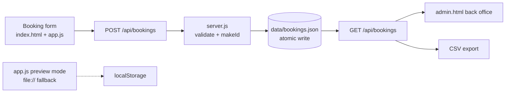

# CofeeShop — Architecture

A coffee shop site with a booking backend that is deliberately boring to operate: one static front end, one zero-dependency Node server, one JSON ledger. Every claim about behaviour is covered by a runnable check.

## Data flow



## Component responsibilities

| File | Responsibility | Side effects | Checked by |
|---|---|---|---|
| `index.html` / `styles.css` | Static site: hero, menu, visit, book form; “11 Build” design tokens | none | `check-pages` |
| `app.js` | Client validation (mirrors server), slot loading, open-hours chip, submit + success card; localStorage fallback for `file://` previews | DOM, `fetch` | `browser-check` |
| `server.js` | HTTP server: static whitelist, booking API, server-side validation, atomic JSON writes, CSV | filesystem write | `smoke` |
| `admin.html` / `admin.js` | Back office: stats (total/upcoming/today), search filter, CSV link | `fetch` | `check-pages` |
| `data/bookings.json` | The ledger (single source of truth) | — | `smoke` |
| `scripts/check-pages.mjs` | 11 HTTP checks across pages, assets, APIs, 404 | HTTP | self |
| `scripts/smoke.mjs` | 11-check booking lifecycle on an isolated port + store | HTTP, temp file | self (cleans up) |
| `scripts/browser-check.mjs` | Real-browser (CDP) 390px submission test + screenshots | browser, HTTP | self |
| `scripts/seed.mjs` | Adds sample bookings to a running server | HTTP | manual |

## Key interfaces

```js
// server.js
validateBooking(input) -> { errors: string[], value: {...} }   // single source of truth
makeId(dateStr, existing) -> "CK-YYYYMMDD-XXXX"                 // collision-safe references

GET  /api/health          -> { ok, service, bookings, uptimeSeconds, store }
GET  /api/slots           -> { ok, slots: ["08:00".."21:00"], first, last }
GET  /api/bookings        -> { ok, count, bookings: [...] }      // newest first
POST /api/bookings        -> 201 { ok, booking } | 400 { ok, errors: [...] }
GET  /api/bookings.csv    -> text/csv attachment
```

## Booking record schema

```json
{
  "id": "CK-20260930-DCAD",
  "name": "Asha Rao",
  "phone": "+91 98450 12345",
  "email": "asha@example.com",
  "date": "2026-09-30",
  "time": "18:00",
  "party": 2,
  "seating": "Terrace",
  "notes": "Sample booking (setup demo)",
  "status": "confirmed",
  "createdAt": "2026-09-29T04:00:39.369Z"
}
```

## Validation rules

Enforced in `server.js`; mirrored client-side in `app.js` for instant feedback:

- **name** 2–80 characters
- **phone** `+?`, 8–18 digits/spaces/dashes
- **email** optional; validated when present
- **date** today → +7 days (no past, no far future)
- **time** one of the hourly slots 08:00–21:00
- **party** integer 1–12

## Storage notes

- Ledger file: `data/bookings.json` (override with `STORE_PATH`).
- Writes are atomic: temp file + `rename`.
- Portable by design: no database server; the file can be inspected, diffed, and backed up without tooling.
