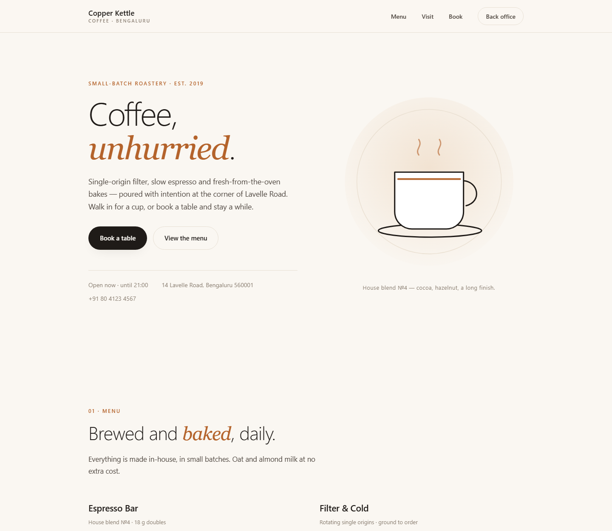
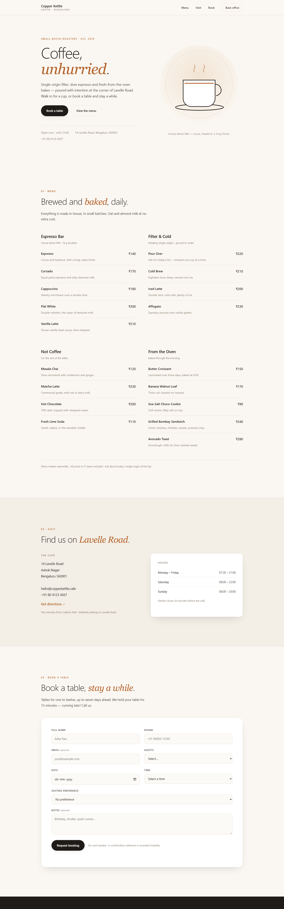
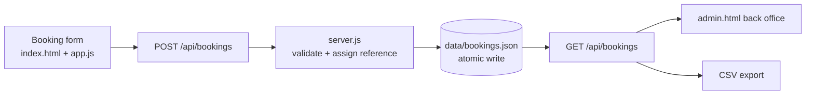
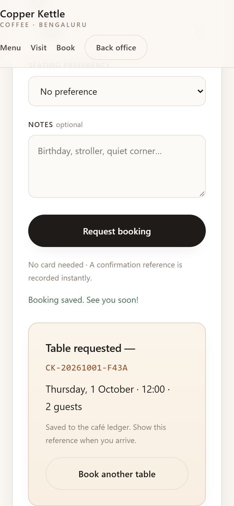
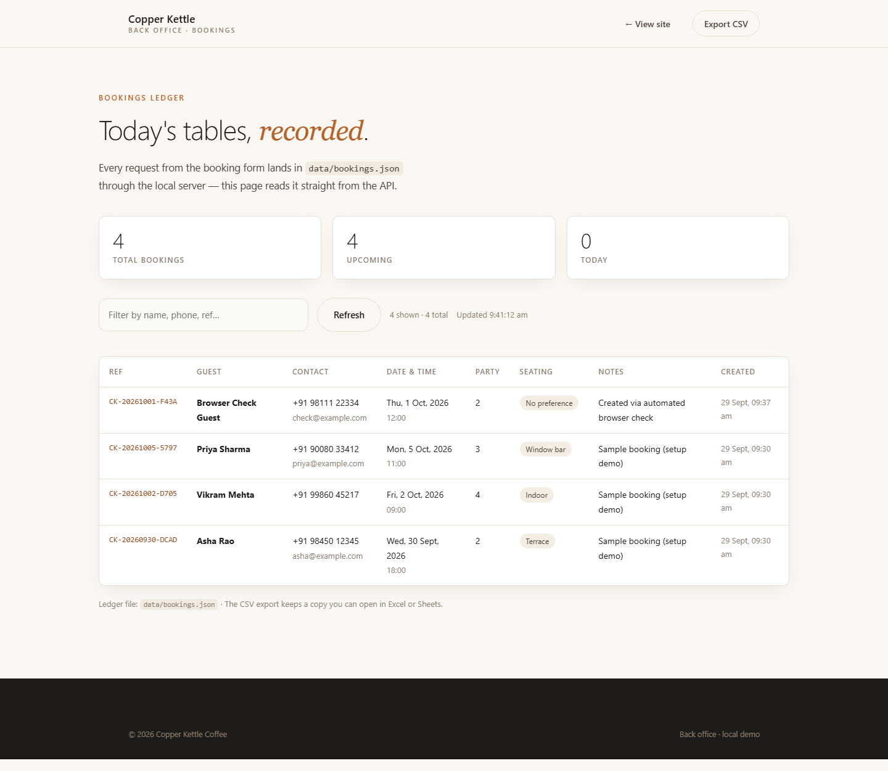
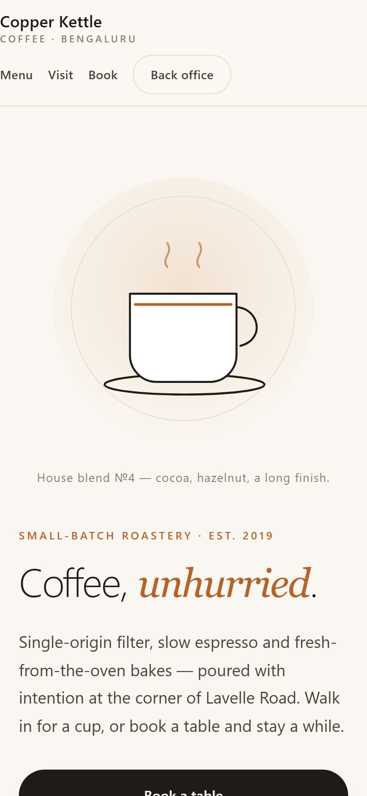
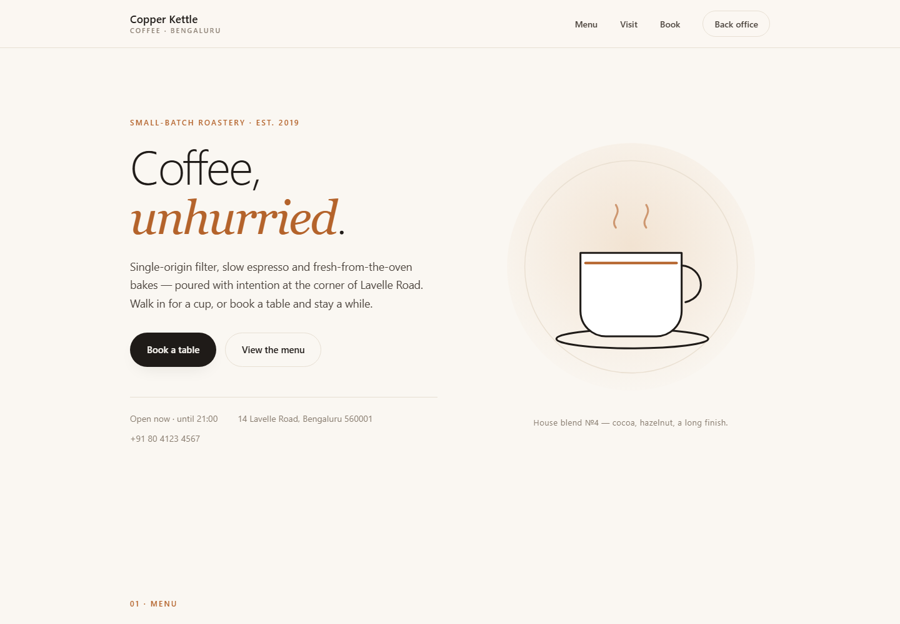

# I Built a Coffee Shop Website with a Zero-Dependency Booking Backend — Here's the Whole Build

*Menu, address, and a booking form that writes real records to disk — verified by 22 automated checks and a real browser, pushed to GitHub, and deployed to a Kali Vagrant box on a forwarded port.*

---

The brief was one paragraph: build a coffee shop website that I can open and preview, with a menu, an address, and a booking entry — and if booking is implemented, it needs data storage or a backend record that saves bookings, **plus run/check results**.

That last clause is what makes the project honest. A booking form that *looks* functional is a weekend of CSS away; a booking flow that provably saves a record, survives a reload, rejects bad input, and shows up in a back office is the actual engineering. So the constraint I set for myself was simple: everything in this build must be **checkable**.

The result is **Copper Kettle Coffee** — and it runs on **plain Node.js with zero npm dependencies**. No framework. No database server. Two commands to run, and a ledger you can read with your own eyes.

```bash
cd CofeeShop
node server.js
# [copper-kettle] booking server listening at http://localhost:3000
```

```
$ curl http://localhost:3000/api/health
{
  "ok": true,
  "service": "copper-kettle-bookings",
  "bookings": 4,
  "store": "data/bookings.json"
}
```



## Design: luxury minimalism as a constraint

The visual brief was a preset called **“11 Build”** — luxury-grade minimalism: 70%+ whitespace, subtle type-weight shifts, one accent color used sparingly, soft shadows, generous rhythm. The constraint helps beyond aesthetics: it forces a small set of tokens (one copper accent, warm paper background, hairline borders, system fonts only) — no remote assets at all, so the page never renders half-loaded.

The site is a single `index.html` with four sections — hero, menu, visit, book — plus the booking form. The menu carries four categories and nineteen items with ₹ prices; the visit section carries the practical details a café actually needs.



## The booking flow, end to end

The interesting surface of this project is the pipeline behind the form:



Client-side validation mirrors the server rules exactly, but the server never trusts the client:

```js
if (v.name.length < 2 || v.name.length > 80) errors.push("name: enter 2–80 characters");
if (!/^[+]?[\d][\d\s-]{7,17}$/.test(v.phone)) errors.push("phone: enter a valid phone number");
if (v.email && !/^[^\s@]+@[^\s@]+\.[^\s@]+$/.test(v.email)) errors.push("email: enter a valid email or leave it blank");
// date: today → 7 days ahead · time: 08:00–21:00 hourly slots · party: 1–12
```

Every accepted booking gets a human-readable reference (`CK-YYYYMMDD-XXXX`), a `createdAt` timestamp, and `status: "confirmed"`:

```json
{
  "id": "CK-20260930-DCAD",
  "name": "Asha Rao",
  "date": "2026-09-30",
  "time": "18:00",
  "party": 2,
  "seating": "Terrace",
  "status": "confirmed",
  "createdAt": "2026-09-29T04:00:39.369Z"
}
```



## Storage: a file you can audit

The ledger is `data/bookings.json` — written with the classic atomic pattern so a crash mid-write can never corrupt it:

```js
function writeBookings(list) {
  const tmp = STORE_PATH + ".tmp";
  fs.writeFileSync(tmp, JSON.stringify(list, null, 2) + "\n", "utf8");
  fs.renameSync(tmp, STORE_PATH); // atomic on the same filesystem
}
```

For a single café the file *is* the right datastore: greppable, diffable, trivial to back up — and honest about its limits (swap in SQLite/Postgres when concurrency grows). The **back office** at `/admin` reads it and shows stats, a searchable table, and a CSV export, so every record is traceable from the UI.



## The checks — three layers, all real

The project ships with three verification layers, and I actually ran them:

**1. Endpoint checks (11)** — every page, asset, and API, with content assertions:

```
$ node scripts/check-pages.mjs
PASS  Home page            /                  → 200 text/html 15111b
PASS  Back office          /admin             → 200 text/html 2746b
PASS  Slots API            /api/slots         → 200 application/json 254b
PASS  CSV export           /api/bookings.csv  → 200 text/csv 777b
PASS  Unknown route → 404  /nope              → 404 text/plain 9b
...
11 passed, 0 failed
```

**2. Lifecycle smoke test (11)** — spins up an isolated server on a throwaway store and exercises the whole path: empty ledger → create 2 bookings → read them back → verify the file on disk → reject a missing name (400) → reject a past date (400) → CSV export. Then it cleans up after itself.

**3. Real-browser submission** — a script drives headless Edge over the Chrome DevTools Protocol, emulates a **390px phone**, fills the form like a visitor, clicks *Request booking*, and reads the confirmation reference (`CK-20261001-F43A`) back out of the success card.



## Three things that actually bit me

**1. A port collision taught me where forwarded ports live.** First instinct for the VM: map guest 3000 to host 3000. But a leftover dev preview was already bound to host 3000 — and VirtualBox binds the *host* side — so the mapping would have failed at reload. The fix was mapping to 8080 and checking `netstat` first. Small thing; would have cost an hour of confusion.

**2. My own test harness “failed” while the app worked.** The browser check first reported `SUCCESS PANEL SHOWN: false` — while the submission had actually gone through and the booking was already in the ledger. The bug was in my CDP client reading the response one level too deep (`r.result.result.value` instead of `r.result.value`). The lesson that keeps paying: verify **state** (the ledger, the DOM), not just your test's own assertions.

**3. Case matters, eventually.** Through one tooling hop, `Dockerfile` landed as `dockerfile` and `README.md` as `readme.md`. Windows doesn't care — Linux `docker build` does. Normalize filenames before you ship.

## Shipping it: GitHub, then a Vagrant VM

The code lives in the `CofeeShop` folder of [`vramanufidato/AIApplications`](https://github.com/vramanufidato/AIApplications/tree/main/CofeeShop) (initial commit `728c9d2`):

```
CofeeShop/
├─ index.html · styles.css · app.js      the site (no build step)
├─ server.js                             booking API + ledger (zero deps)
├─ admin.html · admin.js                 back office
├─ data/bookings.json                    the ledger
├─ scripts/  smoke · check-pages · browser-check · seed
├─ docs/                                 verification screenshots
├─ Dockerfile + README                   deploy guide
```

```bash
git clone https://github.com/vramanufidato/AIApplications.git
cd AIApplications/CofeeShop
node server.js             # → http://localhost:3000 · back office at /admin
node scripts/smoke.mjs     # 11-check lifecycle test
node scripts/check-pages.mjs
```

Deployment target: a **Kali Linux Vagrant box** (already hosting a speaches TTS server on 8969) with the project folder synced into the VM at `/vagrant/coffee-shop`. Two additions wire it up:

```ruby
# Vagrantfile
config.vm.network "forwarded_port", guest: 3000, host: 8080, host_ip: "127.0.0.1"
config.vm.provision "shell", path: "provision-coffee-shop.sh", run: "always"
```

```bash
# provision-coffee-shop.sh (condensed)
apt-get install -y nodejs        # if missing
ufw allow 3000/tcp               # if a firewall is active
# systemd unit: WorkingDirectory=/vagrant/coffee-shop, Restart=always, User=vagrant
systemctl enable --now coffee-shop.service
```

Then `vagrant reload --provision`, and the checks tell the truth from the other side of the NAT:

```
$ node scripts/check-pages.mjs http://127.0.0.1:8080
...
11 passed, 0 failed

$ vagrant ssh -c "systemctl is-active coffee-shop.service"
active
```

The VM even accepts bookings through the forwarded port — `CK-20261004-10CF` was created from the host side and landed in the synced ledger. The pre-existing speaches server on 8969 kept humming, untouched.



## What I'd add next

- **SQLite** when the JSON ledger outgrows comfort — same API, sturdier storage.
- **Auth on `/admin`** before it ever faces a real network.
- **A cloud home** — the Dockerfile is ready; Render/Fly/VPS each take minutes.
- **Availability logic** — capacity per slot, blackout dates, double-booking guards.
- **Confirmations** — email/SMS on booking creation.

## The takeaway

“Plus run/check results” turned out to be the spec that shaped everything: zero dependencies so it runs anywhere, an atomic file write so records survive, three layers of checks so claims survive scrutiny, and a deployment verified from both sides of the port forward. The form is the fun part; the trail of evidence is the product.

The full build — code, tests, screenshots, deploy guide — lives in the [`CofeeShop`](https://github.com/vramanufidato/AIApplications/tree/main/CofeeShop) folder of the repo.

> *Demo data only — the bookings in the screenshots are samples.*

---

*Built in a single session: `node server.js`, open `http://localhost:3000` — or `vagrant up` on the Kali box for `http://localhost:8080`.*
