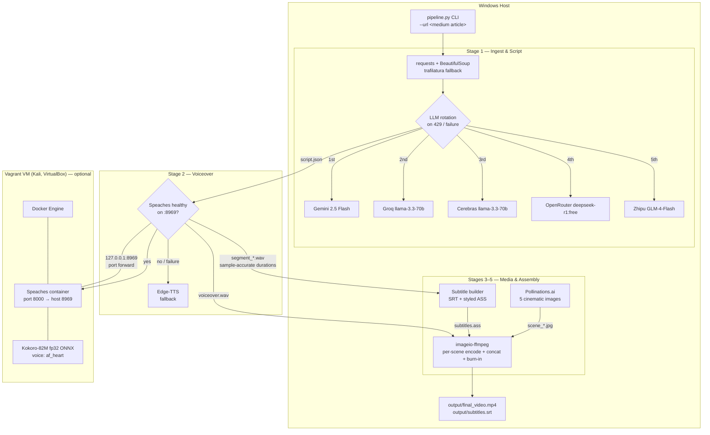
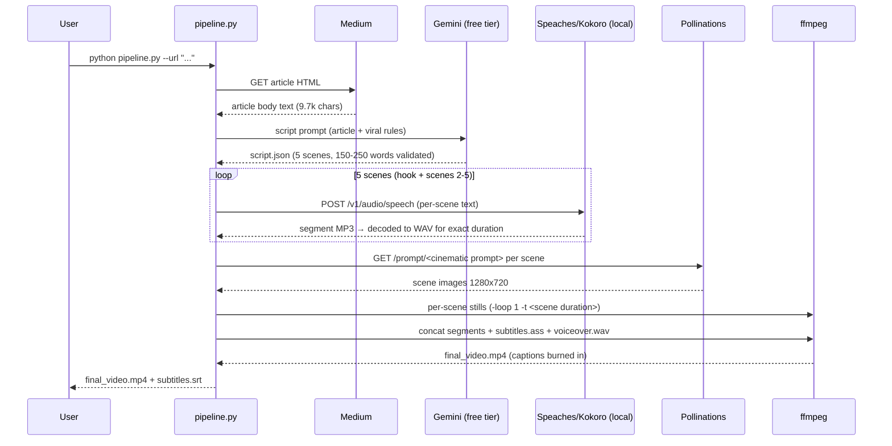

# Architecture

## System overview

## Data flow per run

## Component decisions

### TTS: Speaches + Kokoro in Docker (via Vagrant on Windows)

The host runs no Docker, so the TTS server lives in a Kali Vagrant VM
(VirtualBox, 4 vCPU / 4 GB) with a `127.0.0.1:8969 → guest 8969` port forward.
The pipeline's `ensure_speaches()` resolution order:

1. Server already healthy on `:8969` → use it.
2. Local `docker compose up -d` (native Docker hosts).
3. `vagrant ssh` into `C:/vagrant/aiprj` and start the container there.
4. Any failure at request time → per-segment fallback to Edge-TTS.

On first contact the pipeline installs the model
(`POST /v1/models/speaches-ai/Kokoro-82M-v1.0-ONNX`) into the persistent
`hf-hub-cache` volume and issues a warmup request, because the first inference
after a container restart can stall for minutes while the model reloads.

**fp32 over fp16:** benchmarked on 4 vCPUs, the fp32 ONNX build synthesized a
13s clip in ~22s vs ~50s for fp16 — half_float conversion overhead outweighs the
smaller weights on this CPU. fp32 is therefore the default
(`KOKORO_MODEL` in `pipeline.py`).

### Timing: everything from decoded WAV frames

Two verified failure modes shaped the design:

- MP3 header duration estimates (mutagen) drift several seconds over five
  Kokoro segments → captions and scene cuts desync by mid-video. All durations
  now come from decoding each segment to 24 kHz mono WAV and counting frames.
- ffmpeg's still-image concat demuxer silently drops the final `duration`
  entry, truncating a 101s video at 80s (audio continued to 101s). Assembly now
  encodes each scene as its own segment (`-loop 1 -t <duration>`) and concats
  those, which is length-exact.

### Word-level caption timing without a paid aligner

Kokoro's OpenAI-compatible API returns no word boundaries. Word timings are
allocated proportionally to word length within each scene's *measured* duration,
then chunked into ~6-word captions. Scene-level accuracy is exact (it is the
decoded audio length); within a scene, drift is bounded by the scene length and
is imperceptible for caption purposes.

### Script quality gate

`full_narration` must be 150–250 words. On violation the pipeline retries the
same provider once with corrective feedback (the measured word count), then
rotates to the next provider. The word count is logged at generation time.
