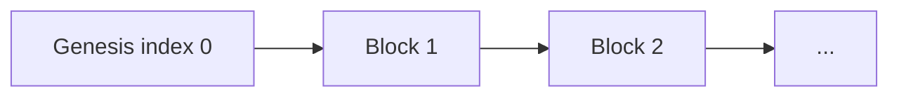

# Building a Minimal Blockchain in Python

A small, educational blockchain: SHA-256 block linking, proof-of-work with a four-zero prefix, a Flask UI to queue transactions and mine blocks, and pytest coverage for the core logic.

This is not production cryptocurrency software. It is a readable slice of how ledgers, hashing, and mining fit together—the same ideas Bitcoin popularized, stripped down to a few hundred lines.

---

## Table of contents

- [What you get](#what-you-get)
- [How it works](#how-it-works)
- [Project layout](#project-layout)
- [Quick start](#quick-start)
- [Using the web UI](#using-the-web-ui)
- [HTTP API](#http-api)
- [Running from the CLI](#running-from-the-cli)
- [Tests](#tests)
- [Troubleshooting](#troubleshooting)
- [Design notes and limits](#design-notes-and-limits)

---

## What you get

| Piece | Role |
|--------|------|
| `blockchain.py` | `Blockchain` class: genesis block, transactions, mining, hashing |
| `app.py` | Flask server with browser forms and JSON endpoints |
| `templates/index.html` | Simple page to add transactions, mine, and view the chain |
| `test_blockchain.py` | Unit tests (proof-of-work mocked where mining would be slow) |

Each block stores:

- **index** — position in the chain (genesis is `0`)
- **timestamp** — when the block was created
- **transactions** — list of `{sender, recipient, amount}` records
- **proof** — nonce found by proof-of-work
- **previous_hash** — SHA-256 fingerprint of the prior block (genesis uses `"0"`)

---

## How it works

### Linked list of blocks

The chain is an append-only list. Every new block includes `previous_hash`, computed from the full contents of the previous block. Change an old block and the fingerprint no longer matches what the next block recorded—an easy integrity check for this demo.



### Block hashing

`hash_block` JSON-serializes the block fields (sorted keys for stable output), then applies SHA-256. The result is a hex string used as `previous_hash` on the following block.

### Proof-of-work

Mining is a search for a **proof** (integer) such that:

```text
SHA256(f"{last_proof}{proof}").hexdigest().startswith("0000")
```

The previous block’s `proof` acts as `last_proof`. On average this takes many tries—roughly one in 65,536 random hashes starts with four hex zeros— which slows down block creation on purpose.

**Flow when you mine:**

1. Pending transactions are copied into the new block.
2. `proof_of_work` runs until a valid hash prefix is found.
3. The block is appended; the pending queue is cleared.

### Mempool (pending transactions)

`add_transaction` does not write to the chain immediately. It appends to `current_transactions`. Only `new_block` / **Mine** commits them into a block.

---

## Project layout

```text
MyBlockchain/
├── blockchain.py          # Core ledger
├── app.py                 # Flask application
├── templates/
│   └── index.html         # Web UI
├── test_blockchain.py     # pytest suite
├── requirements.txt       # flask, pytest
└── README.md
```

---

## Quick start

**Requirements:** Python 3.10+ (3.x with standard library `hashlib`).

```powershell
cd path\to\MyBlockchain
python -m pip install -r requirements.txt
```

Start the web server:

```powershell
python app.py
```

Wait until the terminal shows:

```text
 * Running on http://127.0.0.1:5000
```

Then open [http://127.0.0.1:5000/](http://127.0.0.1:5000/) in your browser.

> **Startup delay:** Importing `app.py` constructs `Blockchain()`, which mines the genesis block before Flask binds to the port. Expect a pause (often tens of seconds) before `Running on…` appears. Refreshing the browser before that line can show `ERR_CONNECTION_REFUSED`.

---

## Using the web UI

1. **Add transaction** — Enter sender, recipient, and amount; submit to queue a transfer.
2. **Mine new block** — Runs proof-of-work and appends a block containing all pending transactions.
3. **Chain (JSON)** — Live view of the full chain on the page.

Mining from the browser may take several seconds per block because of the `0000` difficulty.

---

## HTTP API

Same in-memory chain as the UI. Send `Content-Type: application/json` for JSON responses; HTML forms get redirects back to `/`.

| Method | Path | Description |
|--------|------|-------------|
| `GET` | `/` | HTML dashboard |
| `GET` | `/chain` | Full chain as JSON array |
| `POST` | `/transactions` | Body: `sender`, `recipient`, `amount` |
| `POST` | `/mine` | Mine a block with pending transactions |

**Queue a transaction (JSON):**

```powershell
curl -X POST http://127.0.0.1:5000/transactions `
  -H "Content-Type: application/json" `
  -d "{\"sender\":\"Alice\",\"recipient\":\"Bob\",\"amount\":5}"
```

**Mine:**

```powershell
curl -X POST http://127.0.0.1:5000/mine
```

**Read the chain:**

```powershell
curl http://127.0.0.1:5000/chain
```

Example block shape:

```json
{
  "index": 1,
  "timestamp": 1710000000.123,
  "transactions": [
    {"sender": "Alice", "recipient": "Bob", "amount": 5}
  ],
  "proof": 35293,
  "previous_hash": "a1b2c3..."
}
```

---

## Running from the CLI

Without Flask, run the module directly:

```powershell
python blockchain.py
```

That creates a chain, queues Alice → Bob for 5 coins, mines one block, and prints the entire chain as indented JSON.

From Python:

```python
from blockchain import Blockchain

chain = Blockchain()
chain.add_transaction("Alice", "Bob", 5)
chain.new_block()
print(chain.chain)
```

---

## Tests

Tests avoid real mining loops by patching `proof_of_work` where needed. Cryptographic helpers (`valid_proof`, `hash_block`) are tested directly.

```powershell
python -m pytest -q
```

Coverage includes:

- Valid and invalid proof pairs
- Deterministic and sensitive block hashing
- Genesis block fields
- Transaction queueing and `new_block` clearing pending txs
- `previous_hash` linkage to the prior block’s hash

---

## Troubleshooting

### `ERR_CONNECTION_REFUSED` on http://127.0.0.1:5000/

Nothing is listening on port 5000. Common causes:

1. **`python app.py` is not running** — Start it from the `MyBlockchain` directory and keep the terminal open.
2. **Still starting** — Genesis mining runs at import time; wait for `Running on http://127.0.0.1:5000`.
3. **Process crashed** — Check the terminal for missing dependencies (`pip install -r requirements.txt`) or tracebacks.

Verify a listener (PowerShell):

```powershell
netstat -ano | findstr ":5000"
```

You should see a `LISTENING` line while the server is up.

### Debug reloader

`app.run(debug=True)` restarts the process once (`Restarting with stat`). During restart the port can drop briefly; wait a second and reload.

### Slow mining

Four leading zeros is intentional. For local experiments you could relax the prefix in `valid_proof` (e.g. `"000"`)—at the cost of weaker “work” and faster blocks.

---

## Design notes and limits

- **Single process, in-memory state** — Restarting the server rebuilds a new genesis chain; nothing is persisted to disk.
- **No wallets or balances** — Transactions are recorded but not validated against accounts.
- **No peer network** — One node only; no consensus across machines.
- **No signatures** — Anyone can claim any `sender` name.
- **Development server** — Flask’s built-in server is for learning; use a production WSGI server for real deployments.

Those omissions keep the code small so you can see the spine of a blockchain: **hash-linked blocks**, a **transaction pool**, and **proof-of-work** before append.

---

## License

Use and modify for learning. If you extend this project, consider adding persistence, chain validation, and adjustable difficulty as follow-up exercises.
