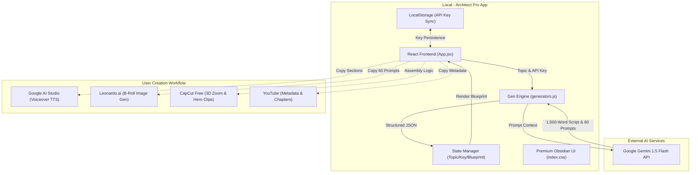

# Architect Pro v2: YouTube Orchestration Engine

Architect Pro v2 is a premium standalone application designed to automate the orchestration of 10-minute long-form YouTube videos. It leverages **Google Gemini 1.5 Flash** to generate 1,500-word scripts, 60+ visual prompts, and SEO metadata in seconds.

## 🚀 Key Features
- **Narrative Architect**: Generates 5-chapter scripts with precisely 1,500 words.
- **Visual Asset Hub**: Creates 60 image prompts for Leonardo.ai and 12 Hero clips for CapCut.
- **SEO Optimizer**: Generates CTR-focused titles, 500-word summaries, and auto-timestamps.
- **Obsidian Dark Mode**: A professional, high-end interface for content creators.

## 🛠️ Architecture

Here is the system architecture of the application and its integration into the content creation workflow:



## 📦 Setup & Installation

1. **Clone the repository** and navigate to the `utube` directory.
2. **Install dependencies**:
   ```bash
   npm install
   ```
3. **Launch the app**:
   ```bash
   npm run dev
   ```
4. **Configure AI**: Click on the **'Setup AI'** button in the app and paste your **Gemini 1.5 Flash API Key** from Google AI Studio.

## 🎞️ Workflow Logic
1. **Audio First**: Generate voiceovers in 2-minute sections for high quality.
2. **Image Animation**: Apply '3D Zoom' in CapCut for static image motion.
3. **Hero Clips**: Insert the 12 AI-generated video clips at major chapter transitions.
